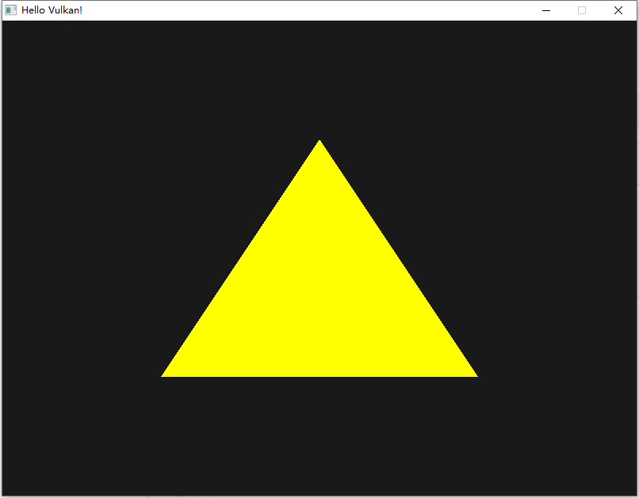

# vscode vulkan 渲染器

## 工程 

在 vscode 配置好 cmake + gcc 后可以直接进行开发

项目所依赖的三个模块, 已经全部打包到项目中

- glfw
- glm
- vulkan

## 使用

1. 使用 vscode 打开工程
2. vscode 配置好 cmake （Makefile 生成辅助）和 gcc（编译器）
3. vscode 执行指令 `CMake:Config`，或者 vscode cMake 插件大部分情况会自动运行 
4. vscode 执行指令 `CMake:Build`，或者按 F7
5. TERMINAL 运行 ./build/renderer ，或者按 F5 使用 Debug 模式运行

